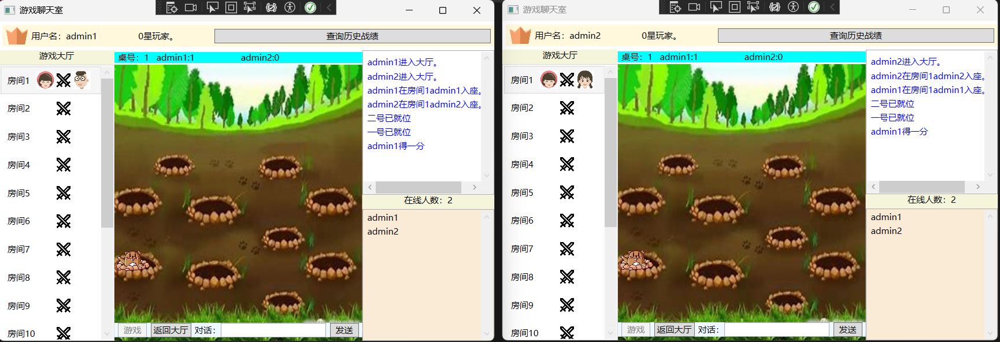

# OnlineWhackMole

- OnlineWhackMole 在线打地鼠游戏

  ## 📖 项目简介

  基于 WCF 实现的**在线双人联机打地鼠小游戏**，支持用户注册、登录、双人实时对战计分，率先获得 3 分的玩家获胜。

  ---

  ## 🚀 项目启动前置说明（重要）

  本项目使用 **SQL Server LocalDB 本地数据库**，为缩减 Git 仓库体积、避免大文件提交，**已移除原始 \.mdf/\.ldf 数据库文件**。

  **首次运行项目必须手动构建数据库**，否则程序无法正常连接数据库、功能失效。

  ---

  ## 📁 数据库构建步骤（必做）

  按照以下步骤操作，即可生成适配项目路径的数据库文件，完美适配程序连接规则：

  **步骤 1：打开项目**

  双击项目根目录 `DaDiShu\.sln`，使用 Visual Studio 打开完整解决方案。

  **步骤 2：打开数据库工具**

  顶部菜单栏选择：`视图` →`SQL Server 对象资源管理器`

  **步骤 3：新建数据库查询**

  右键数据库实例：`\(localdb\)\\MSSQLLocalDB` → 选择 `新建查询`

  **步骤 4：执行建库脚本**

  打开项目路径：`Service/Database/`，复制目录下的完整 SQL 脚本，粘贴到查询窗口并执行。

  脚本会自动创建：

  - **player 数据库**

  - **table1 用户账号表**（存储账号、密码、积分）

  - **records 游戏记录表**（存储积分变动、操作时间记录）

  **步骤 5：查看数据库真实存放路径**

  在查询窗口执行以下 SQL 命令，查看刚创建的数据库文件位置：

  ```sql
  SELECT 
      name AS 逻辑文件名,
      physical_name AS 真实物理路径
  FROM 
      sys.master_files
  WHERE 
      database_id = DB_ID('player');
  ```

  **步骤 6：迁移数据库文件到项目目录**

  1. 根据上方查询出的路径，找到 `player\.mdf`、`player\_log\.ldf`两个文件

  2. 复制两个文件，粘贴到项目目录：`\\Service\\App\_Data\\`

  3. 保证程序可以通过相对路径正常读取数据库

  ---

  ## ▶️ 项目调试运行方式

  为实现双人联机对战效果，**调试阶段需要启动两个客户端窗口**，即可进行双人联机游戏。

  ---

  ## 🎮 游戏功能说明

  ### 1\. 注册登录功能

  支持用户账号注册、密码登录，账号信息自动存入本地数据库，保存用户游戏积分数据。

  

  ### 2\. 双人对战规则

  - 两名玩家进入同一对战房间后，开启游戏

  - 点击刷新出现的地鼠即可得分

  - 率先累计获得 **3 分** 的玩家获得本局胜利

  - 游戏积分、对战记录自动存入数据库保存

  

  ---

  ## 📌 补充说明

  - 数据库原始文件已加入 Git 忽略，每次拉取/克隆项目需自行执行脚本构建数据库

  - 所有数据库结构、表结构均已封装在项目 SQL 脚本中，一键执行即可还原完整环境

  - 项目基于 WCF 通信，本地运行无需额外配置服务器，仅需 LocalDB 环境


